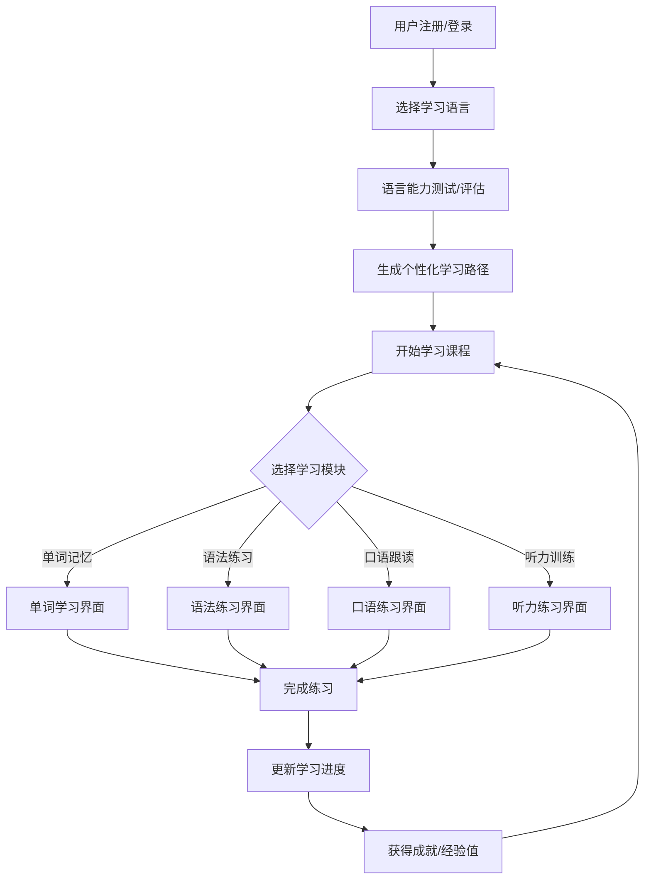
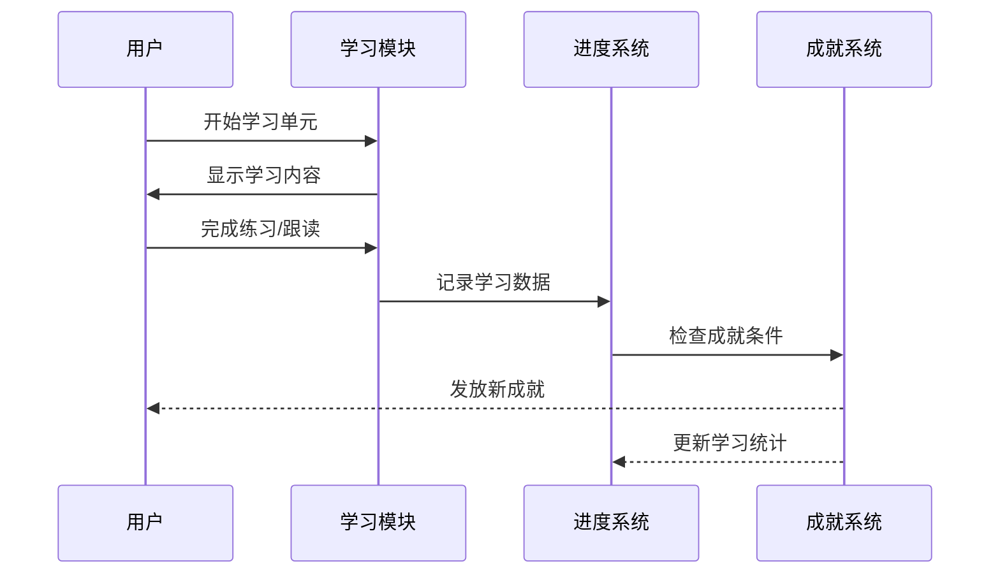

# 多语种在线教育平台 - 产品需求文档 (PRD)

## 1. 产品概述

LinguaWorld 是一款沉浸式多语种在线学习平台，支持英语、日语、韩语等主流语言的学习。平台通过互动式学习模块、智能进度追踪和个性化学习路径，为用户打造专业、高效的语言学习体验。

**核心价值：**
- 一站式多语言学习解决方案
- 游戏化学习体验，提升学习动力
- AI驱动的个性化学习路径
- 沉浸式互动练习，即学即用

**目标用户：**
- 语言学习初学者到中高级学习者
- 准备留学/移民的语言考试备考者
- 商务人士需要提升外语能力
- 对外国文化感兴趣的爱好者

---

## 2. 核心功能模块

### 2.1 用户角色

| 角色 | 注册方式 | 核心权限 |
|------|---------|---------|
| 游客 | 无需注册 | 浏览课程简介、语言选择 |
| 注册用户 | 邮箱/手机注册 | 完整学习功能、进度追踪、社区互动 |
| VIP用户 | 付费升级 | 解锁高级课程、AI辅导、一对一答疑 |

### 2.2 功能模块总览

1. **首页/语言选择** - 沉浸式语言选择界面
2. **用户认证** - 注册、登录、个人中心
3. **分级课程体系** - CEFR级别课程内容
4. **互动学习模块** - 单词记忆、语法练习、口语跟读、听力训练
5. **学习进度追踪** - 数据可视化、个人统计
6. **个性化推荐** - 智能学习路径生成
7. **社区系统** - 学习小组、话题讨论
8. **成就系统** - 徽章、排行榜、连续学习奖励

---

## 3. 核心流程

### 3.1 用户学习流程

### 3.2 学习模块交互流程

---

## 4. 用户界面设计

### 4.1 设计风格

**设计理念：现代极简 + 沉浸式学习体验**

- **主色调**：
  - 英语：蓝色系 (#3B82F6 - 天蓝色)
  - 日语：红色系 (#EF4444 - 樱花粉红)
  - 韩语：紫罗兰系 (#8B5CF6 - 时尚紫)
  - 通用：深灰色 (#1F2937) 用于文字和强调

- **辅助色**：
  - 成功绿 (#10B981)
  - 警告橙 (#F59E0B)
  - 错误红 (#EF4444)
  - 背景灰 (#F9FAFB)

- **字体选择**：
  - 标题：Noto Sans SC (中文), Noto Sans JP (日语), Noto Sans KR (韩语)
  - 正文：Inter (英文学习内容)
  - 代码/音标：JetBrains Mono

- **按钮风格**：圆角按钮 (border-radius: 12px)，悬停时带有微妙的阴影提升效果

- **布局风格**：
  - 卡片式布局展示课程
  - 底部导航用于移动端
  - 侧边栏导航用于桌面端
  - 大留白空间，聚焦学习内容

- **图标风格**：线性图标 (Lucide Icons)，简洁现代

### 4.2 页面设计

#### 4.2.1 首页 (Home)

| 模块 | UI元素 | 设计细节 |
|------|--------|---------|
| Hero区域 | 全屏语言选择器 | 3D悬浮语言卡片，鼠标悬停缩放效果 |
| 语言卡片 | 圆形图标 + 语言名称 | 悬停显示该语言学习人数 |
| 特色展示 | 横向滚动画廊 | 展示学习成果和用户评价 |
| 快速入口 | 渐变按钮 | 登录/注册引导 |

#### 4.2.2 学习仪表盘 (Dashboard)

| 模块 | UI元素 | 设计细节 |
|------|--------|---------|
| 进度概览 | 环形进度图 | 显示本周学习目标完成度 |
| 今日任务 | 待办卡片列表 | 拖拽完成打卡 |
| 学习统计 | 折线图 | 7天学习时长趋势 |
| 成就墙 | 徽章网格 | 已获得成就展示 |

#### 4.2.3 单词记忆模块 (Vocabulary)

| 模块 | UI元素 | 设计细节 |
|------|--------|---------|
| 单词卡片 | 翻转卡片动画 | 点击翻转显示释义和例句 |
| 记忆曲线 | 进度条 | 标记遗忘点复习时间 |
| 练习区 | 闪卡测验 | 左右滑动判断认识程度 |
| 发音 | 音频播放按钮 | 点击播放标准发音 |

#### 4.2.4 语法练习模块 (Grammar)

| 模块 | UI元素 | 设计细节 |
|------|--------|---------|
| 语法讲解 | 可折叠面板 | 简洁明了的语法规则说明 |
| 练习题 | 填空/选择/改错 | 即时反馈正确/错误 |
| 错题本 | 错题列表 | 记录并支持重新练习 |

#### 4.2.5 口语跟读模块 (Speaking)

| 模块 | UI元素 | 设计细节 |
|------|--------|---------|
| 跟读内容 | 大字显示文本 | 高亮当前朗读句子 |
| 录音控件 | 录制/播放/对比 | 可回听自己的录音 |
| 评分系统 | 星形评分 | 展示发音准确度百分比 |
| 波形可视化 | 音频波形图 | 直观展示音频对比 |

#### 4.2.6 听力训练模块 (Listening)

| 模块 | UI元素 | 设计细节 |
|------|--------|---------|
| 听力材料 | 音频播放器 | 可调速、循环、分段 |
| 练习题型 | 听写/选择/判断 | 边听边练 |
| 原文展示 | 可折叠原文 | 练习后可对照 |

#### 4.2.7 社区页面 (Community)

| 模块 | UI元素 | 设计细节 |
|------|--------|---------|
| 话题列表 | 卡片式列表 | 显示热度、回复数 |
| 发布区 | 富文本编辑器 | 支持文字、图片 |
| 学习小组 | 群组卡片 | 加入学习小组 |
| 排行榜 | 实时排名 | 显示学习积分和连续天数 |

---

## 5. 数据可视化

### 5.1 学习进度展示

- **环形进度图**：整体完成度
- **柱状图**：各模块学习时长分布
- **折线图**：学习趋势分析
- **热力图**：每日学习活跃度

### 5.2 成就系统可视化

- **徽章墙**：3x4 网格展示已获成就
- **进度条**：当前等级进度
- **排行榜**：周榜、月榜、总榜

---

## 6. 响应式设计

- **桌面端 (≥1024px)**：侧边栏导航，三栏布局展示课程
- **平板端 (768-1023px)**：顶部导航，两栏布局
- **移动端 (<768px)**：底部Tab导航，单栏布局，触控优化

---

## 7. 技术优先级

### P0 (必须实现)
1. 用户注册/登录系统
2. 语言选择和基础课程浏览
3. 单词记忆模块（完整）
4. 学习进度追踪（基础）
5. 用户个人资料页面

### P1 (重要功能)
1. 语法练习模块
2. 成就和徽章系统
3. 社区讨论功能
4. 个性化学习路径推荐

### P2 (增强体验)
1. 口语跟读模块（录音功能）
2. 听力训练模块
3. 学习小组功能
4. 实时排行榜
